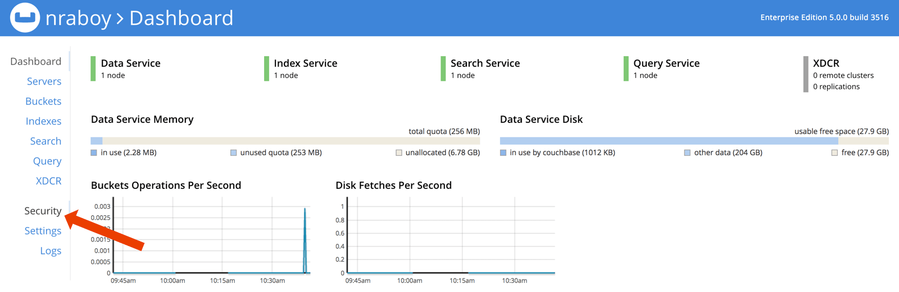
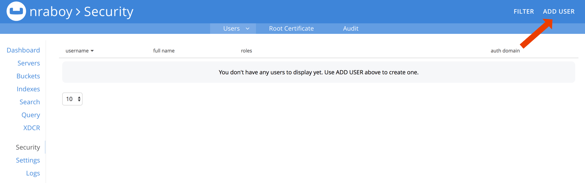
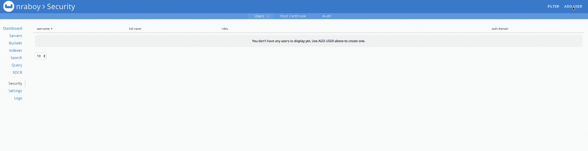
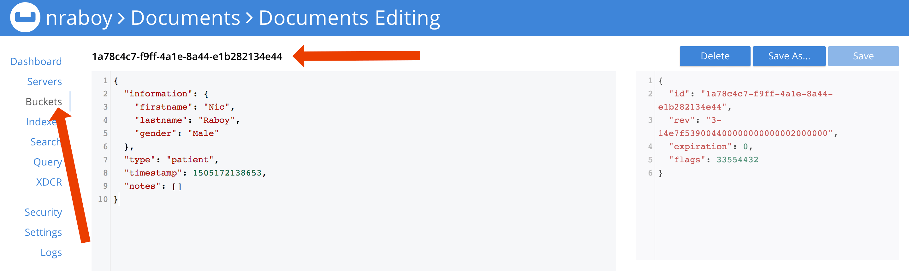
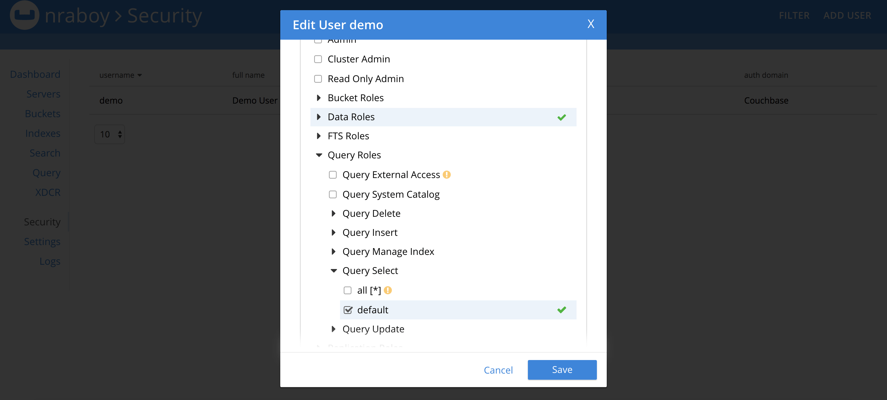
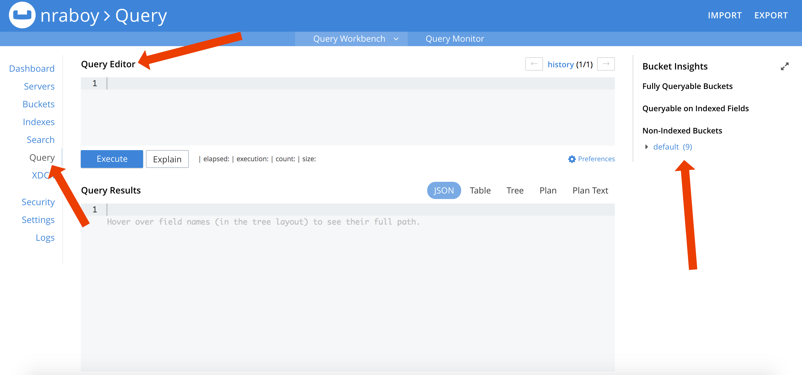
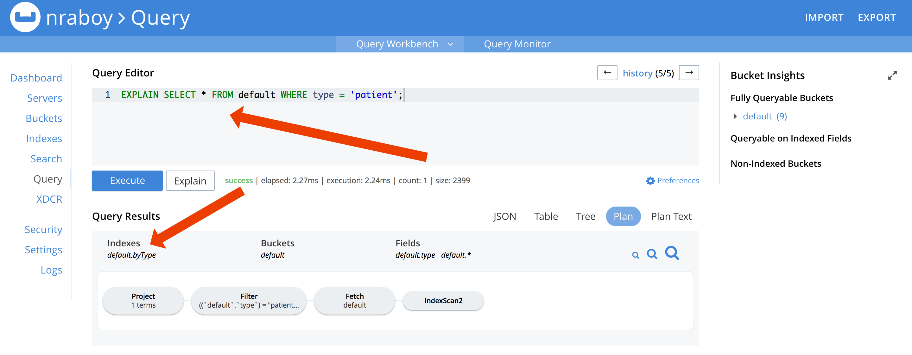
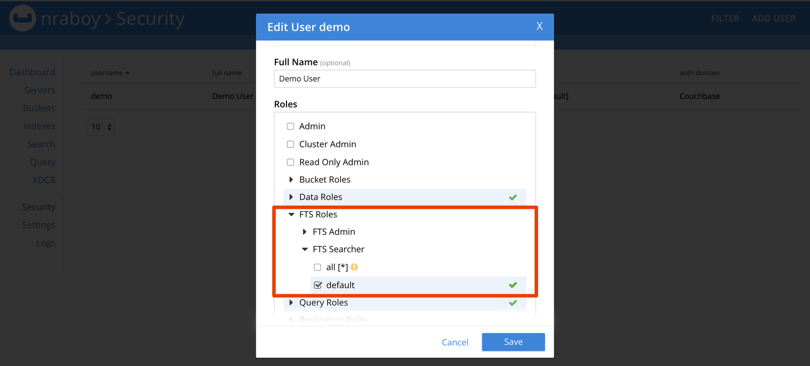
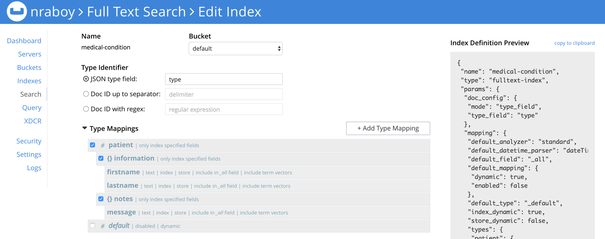
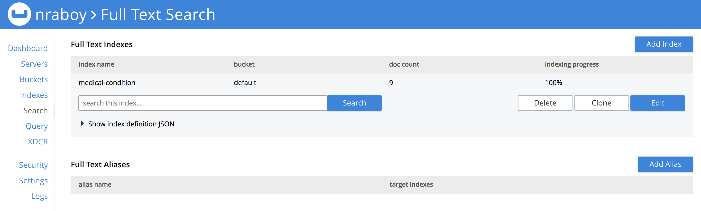

# Couchbase Connect 2017 Workshop

This repository is a workshop for .NET, Java, Node.js, and PHP developers interested in Couchbase NoSQL. By completing this workshop you'll walk away with skills in N1QL, Full Text Search (FTS), Sub-Document Operations, and best practices in API design.

To download this repository, execute the following:

```
git clone https://github.com/couchbaselabs/workshop
```

The repository can also be downloaded directly as a ZIP archive by clicking [here](https://github.com/couchbaselabs/workshop/archive/master.zip).

## Requirements

Depending on the preferred development technology, there are multiple software requirements that must be met to be successful with this workshop. These requirements include the following:

* Mac OS 10.11+ or Windows 8+
* Couchbase Server 5.0+ Enterprise Edition
* Postman for Chrome
* Node.js 8.5.0
* Java Development Kit (JDK) 8
* .NET Core 1.1 Runtime
* .NET Core SDK
* PHP 7.1 and PHP SDK 2.4.1 (also configured in docker-compose)

Not all the Node.js, Java, and .NET software dependencies are required. Pick the development technology that you plan to use within the workshop of the three choices. Postman will be used for testing any API routes created within the workshop.

## The Workshop Breakdown

The workshop is broken down into two core sections, each with their own sub-sections. The two sections consist of an **initial** project and a **complete** project. The instructions in this README will walk you through the development of the **initial** project which will become **complete** as a final result. If at any point in time you'd like to validate your work, find the corresponding sub-section in the **complete** directory.

## Instructions

The **initial** project is split into nine parts, where each part gets progressively more complicated. The goal behind the project is to create an application centered around medical data for patients and doctors.

### Step 0 - Understanding the Data Model

When creating an application around patients and doctors, it makes sense to have at least three different distinct types of data. There is data for patients, data for doctors, and data shared between the two, such as as appointments.

Take the model below as a possibility for patient data:

```
{
    type: "patient",
    information: {
        firstname: string,
        lastname: string,
        gender: string
    },
    notes: [
        {
            doctor: string,
            message: string,
            timestamp: long
        }
    ],
    timestamp: long
}
```

In the above document we have personal information about the patient, a history of notes applied to a patient by doctors, and an identifier marking the document as patient data.

Documents that represent doctor data can follow a similar model:

```
{
    type: "doctor",
    information: {
        firstname: string,
        lastname: string,
        gender: string
    },
    department: string,
    patients: array<string>,
    timestamp: long
}
```

In the above document model there is a `patients` property. This will represent an array of document keys for patient documents. When a doctor is assigned a patient, the patient will be added to the array of possible patients.

The third type of document that represents appointment data is a little different. Take the following for example:

```
{
    type: "appointment",
    doctor: string,
    patient: string,
    appointment: long,
    timestamp: long
}
```

The above document model will keep track of patient and doctor information as well as a scheduled appointment time. The document isn't particularly fascinating in its current form, but when progressing through the workshop, it will make more sense when querying.

Any one of the three document models could have been designed one hundred different ways. However, the current models demonstrate complex data and document relationships, perfect for the material to come. More information on data modeling in Couchbase can be found in the [Data Modeling Basics](https://developer.couchbase.com/documentation/server/current/data-modeling/intro-data-modeling.html) section of the developer documentation.

### Step 1 - Authenticating with a Role Based Account

Starting in Couchbase 5.0, role-based accounts must be created and used within the application. Previously a Bucket name and Bucket password was enough, but now the details must be more fine grained.

For example, the application user must receive permission for every action including creating, searching, or even querying for data.

To create a role-based account, visit the Couchbase Administrator Dashboard and search for the **Security** tab.



By default, no users will have been created beyond the administrative user that you're already signed in with. At the top of the screen, choose **ADD USER** to create a new user account.



Each user must have a unique username as well as a password with a minimum of six characters. The user can have any number of permissions roles, but for now we only want the user to be able to read and write data using basic key-value operations.



Under **Data Roles**, choose the **Data Writer** and **Data Reader** roles for only the Bucket we plan to use. It is never advisable to give an application user access to more Buckets than necessary.

More information on defining access rules can be found in the [Role-Based Access Control (RBAC) for Administrators](https://developer.couchbase.com/documentation/server/current/security/concepts-rba.html) section of the developer documentation.

With the account created, open the **inital** project in your desired development language. With the project open, search for the comment referring to the first step. The goal is to tell the SDK to authenticate with the new user account.

For help with authenticating using various programming languages, check out [this blog post](https://blog.couchbase.com/new-sdk-authentication/) that outlines the API that should be used.

### Step 2 - Creating NoSQL Documents within Couchbase

By now an application account should be configured with some basic role definitions. The first step towards creating a great application is creating data.

There are two ways to accomplish creating new documents within Couchbase. A simple `insert` operation can be made like so:

```javascript
// Node.js
bucket.insert("key-here", {}, callback);
```

More information regarding data creation with Node.js can be found in the official [Node.js SDK documentation](http://docs.couchbase.com/sdk-api/couchbase-node-client-2.4.1/Bucket.html#insert).

```c#
// .NET
var result = await _bucket.InsertAsync(new Document<Model>{ Id = key, Content = Model });
```

More information regarding data creation with .NET can be found in the official [.NET SDK documentation](http://docs.couchbase.com/sdk-api/couchbase-net-client-2.5.0/html/fc8d406a-df70-0eaf-007e-fea118ea8b04.htm).

```java
// Java
bucket.insert(JsonDocument.create("key-here", {}))
```

More information regarding data creation with Java can be found in the official [Java SDK documentation](http://docs.couchbase.com/sdk-api/couchbase-java-client-2.5.1/com/couchbase/client/java/Bucket.html#insert-D-).

```php
// PHP
$bucket->insert("key-here", [])
```

More information regarding data creation with PHP can be found in the official [PHP SDK documentation](http://docs.couchbase.com/sdk-api/couchbase-php-client-2.4.1/classes/Couchbase.Bucket.html#method_insert).

Data can also be created through N1QL queries with the `INSERT` or `UPSERT` operators:

```
INSERT INTO `bucket-name-here` (KEY, VALUE) VALUES ("key-here", {});
```

However, remember the roles that were assigned to the user account. The roles allowed were for data operations, but not N1QL.

Within the project, search for the comments referring to the second
step, "Step 2".  Note that throughout this workshop, when referring to
a step, there may be multiple methods stubbed out for a given step.  The goal is to take the request payload and create a new document from it with a unique document key. If there was an error, it should be returned, otherwise the created document should be returned.

### Step 3 - Getting Data by Document Id

Now that data exists in the database, it would be beneficial to be able to retrieve it from within the application. In the previous step, documents were created using a unique id. If the id wasn't returned in the response, we can always obtain it from within the Couchbase Administrator Dashboard to continue:



With the document key, a basic data operation can be used for retrieval within the application.

```javascript
// Node.js
bucket.get("key-here", callback);
```

More information on retrieving documents by their keys with JavaScript can be found in the [Node.js SDK documentation](http://docs.couchbase.com/sdk-api/couchbase-node-client-2.4.1/Bucket.html#get).

```c#
// .NET
var result = await _bucket.GetAsync<Model>("key-here");
```

More information on retrieving documents by their keys with .NET can be found in the [.NET SDK documentation](http://docs.couchbase.com/sdk-api/couchbase-net-client-2.4.8/html/3cffb7d4-a581-8ff8-d743-4b4fe0925509.htm).

```java
// Java
bucket.get("key-here");
```

More information on retrieving documents by their keys with Java can be found in the [Java SDK documentation](http://docs.couchbase.com/sdk-api/couchbase-java-client-2.5.1/com/couchbase/client/java/Bucket.html#get-java.lang.String-).

```php
// PHP
$bucket->get("key-here");
```

More information on retrieving documents by their keys with PHP can be found in the [PHP SDK documentation](http://docs.couchbase.com/sdk-api/couchbase-php-client-2.4.1/classes/Couchbase.Bucket.html#method_get).

Like with document creation, lookups can also happen via a N1QL query with a `SELECT` operator:

```
SELECT * FROM `bucket-name-here` WHERE META().id = 'key-here';
```

Unless you've altered the roles for your user account, a N1QL query using a `SELECT` operator will result in errors due to lack of permissions.

Within the project, search for the third step, "Step 3". The goal here is to retrieve documents based on a provided document key and return them back to the client.

### Step 4 - Querying for Multiple Documents with N1QL

Returning documents by their id is great, but often the key won't immediately be known until progressing further into a client facing application. Take a master-detail concept. In the master page a list of data, or in this case documents, will be presented. When choosing from the list, more information about the specific piece of data will be requested.

Simple key-value operations cannot be used to query for data. Instead N1QL must be used, which will require some further configuration.

Up until now, the application account might only have the **Data Writer** and **Data Reader** roles. Head back into the Couchbase Administrator Dashboard and enable the **Query Select** role from the **Query Roles**.



Looking forward, other **Query Roles** will need to be enabled, but you should practice only enabling what you need. For this reason, leave them disabled until you need them.

By now the application should be able to use N1QL. However, no indexes were created. Within the Couchbase Administrator Dashboard, find the **Query Editor**.



Indexes should be created based on the data needs of each executed N1QL query. When prototyping, it is often convenient to create a primary index like so:

```
CREATE PRIMARY INDEX ON `bucket-name-here`;
```

The primary index is generic and will work for every possible query. However, it is far from fast and is never a good idea when working in a production environment where speed is everything. Instead think of what your goal is with a query. Say we want to query for all patient documents or all doctor documents. We know these documents are defined by a `type` property. With this information, the following index can be created:

```
CREATE INDEX `byType` ON default(type);
```

The above index is named `byType` and uses the `type` property. Try to enter the following query into the **Query Editor**:

```
EXPLAIN SELECT * FROM `bucket-name-here` WHERE type = 'patient';
```

Not only should the query succeed, but it should give you information in regards to what index is being used.



If no primary index was available and no specific index was found, the query would have returned an error.

More information on indexes can be found in the documentation [here](https://developer.couchbase.com/documentation/server/current/indexes/gsi-for-n1ql.html).

With the proper account roles in place as well as N1QL indexes, it is time to execute the queries via the application.

```javascript
// Node.js
var query = N1qlQuery.fromString("N1QL-QUERY-HERE");
bucket.query(query, callback);
```

For more information regarding querying with Node.js, check out the [Node.js SDK documentation](http://docs.couchbase.com/sdk-api/couchbase-node-client-2.4.1/Bucket.html#query) for Couchbase.

```c#
// .NET
var query = QueryRequest.Create("N1QL-QUERY-HERE");
var result = await _bucket.QueryAsync<Model>(query);
```

For more information regarding querying with .NET, check out the [.NET SDK documentation](http://docs.couchbase.com/sdk-api/couchbase-net-client-2.5.0/html/7701d5a5-5880-411f-7836-5a409b02e92f.htm).

```java
// Java
bucket.query(N1qlQuery.simple("N1QL-QUERY-HERE"));
```

For more information regarding querying with Java, check out the [Java SDK documentation](http://docs.couchbase.com/sdk-api/couchbase-java-client-2.5.1/com/couchbase/client/java/Bucket.html#query-com.couchbase.client.java.query.N1qlQuery-).

```php
// PHP
$bucket->query(N1qlQuery::fromString("N1QL-QUERY-HERE"));
```

For more information regarding querying with PHP, check out the [PHP SDK documentation](http://docs.couchbase.com/sdk-api/couchbase-php-client-2.4.1/classes/Couchbase.Bucket.html#method_query).

Within the project, find the comments for the fourth step, "Step 4". The goal here is to return all documents for a particular document type. There are several document types, per the data models, so this step will span multiple locations.

A `SELECT` operator will be used in this example. More information on using `SELECT` can be found in the [N1QL documentation](https://developer.couchbase.com/documentation/server/current/n1ql/n1ql-language-reference/selectintro.html).

### Step 5 - Using Parameterized Queries with N1QL

In the previous step, several queries were created for retrieving multiple documents. However, none of the queries were created with user generated data.

When accepting user data, it might be first instinct to create a query that looks like this:

```
var query = "SELECT * FROM `bucket-name-here` WHERE META().id ='" + myVariableId + "'";
```

The above would work, but it opens you up to a huge security vulnerability. In the above example `myVariableId` could be anything, including a well thought out string that converts the query to do something malicious. Instead, it is best practice to treat user defined data as parameters, something the SDK handles differently.

```
var query = "SELECT * FROM `bucket-name-here` WHERE META().id = $id";
```

In the above example `$id` represents a parameter name, not actual data. This parameter name will be populated per the APIs in the Couchbase SDK.

Take the following for example:

```javascript
// Node.js
var query = N1qlQuery.fromString("N1QL-QUERY-HERE");
bucket.query(query, { "id": myVariableId }, callback);
```

```c#
// .NET
var query = QueryRequest.Create("N1QL-QUERY-HERE");
query.AddNamedParameter("id", myVariableId);
var result = await _bucket.QueryAsync<Model>(query);
```

```java
// Java
ParameterizedN1qlQuery query = ParameterizedN1qlQuery.parameterized("N1QL-QUERY-HERE", JsonObject.create().put("id", myVariableId));
bucket.query(query)
```

```php
$query = N1qlQuery::fromString("N1QL-QUERY-HERE");
$query->namedParams(['id' => $myVariableId]);
$result = $bucket->query($query);
```

The `myVariableId` variable is assigned to the `id` parameter which looks like `$id` in the actual query. If the user decides to pass something malicious into the variable, it won't have any negative effects on the data or database.

Within the project, find the comment referencing the fifth step, "Step
5". The goal here is to make use of parameterized queries using user defined data. There will be several queries in this step, each performing a different task.

More information on using parameterized queries can be found in the [N1QL query documentation](https://developer.couchbase.com/documentation/server/current/sdk/n1ql-query.html).

### Step 6 - Executing Complex Queries with N1QL

Querying for documents with parameters is great, but up until now the queries being used were not particularly complex. For example, the previous queries were based on document keys and a few other properties that appeared in a `WHERE` condition.

What happens if the queries need to bring documents together or evaluate documents with more depth than top-level properties?

Think back to the data models that were planned at the beginning of the workshop. Each of the models had some kind of relationship with another document model. For example, the documents with doctor data had properties called `patients` which were an array of document keys for patient documents. It might be valuable to use a `JOIN` operator to query for data in matching scenarios.

Within the project, find the comments referring to the sixth step,
"Step 6". Two different queries should be used depending on what the client passes.

The first query should find all patients that were assigned to a particular doctor. The second query should find all patients that a doctor has serviced. Being assigned to a doctor does not mean serviced. Instead, serviced patients will have a note from a doctor.

### Step 7 - Mutating Part of a JSON Document

As the application is used, the data in the database will grow. The growth will happen not only in how many documents exist in the database, but how much data exists in each particular document. Let's say patient X visits the doctor 300 times in 5 years. This means that doctors have left 300 notes that exist as an array in any patient document. While possible to query for this patient document, it is now quite large.

Instead of wasting bandwidth on retrieving the entire document, it may make sense to retrieve or mutate part of the document. This is possible through sub-document operations in Couchbase.

Take for example the following:

```javascript
// Node.js
bucket.mutateIn("DOCUMENT-KEY-HERE", 0, 0).upsert("information.firstname", "Nicolas", true).execute(callback);
```

More information regarding updating part of a document can be found in the `MutateInBuilder` [documentation for the Node.js SDK](http://docs.couchbase.com/sdk-api/couchbase-node-client-2.4.1/MutateInBuilder.html).

```c#
// .NET
IMutateInBuilder<dynamic> builder = _bucket.MutateIn<dynamic>("DOCUMENT-KEY-HERE").Upsert("information.firstname", "Nicolas", true);
var result = await builder.ExecuteAsync();
```

More information regarding updating part of a document with .NET can be found in the [.NET SDK documentation](http://docs.couchbase.com/sdk-api/couchbase-net-client-2.5.0/html/56cb6607-1f95-4937-bcf1-64f3896e857d.htm) for the `IMutateInBuilder` interface.

```java
// Java
SubdocOptionsBuilder builder = new SubdocOptionsBuilder();
builder.createParents(true);
bucket().mutateIn("DOCUMENT-KEY-HERE").upsert("information.firstname", "Nicolas", builder).execute();
```

More information regarding updating part of a document with Java can be found in the [Java SDK documentation](http://docs.couchbase.com/sdk-api/couchbase-java-client-2.5.1/com/couchbase/client/java/subdoc/MutateInBuilder.html) for the `MutateInBuilder`.

```php
// PHP
$bucket->mutateIn("DOCUMENT-KEY-HERE")
    ->upsert("information.firstname", "Nicolas", ['createPath' => true])
    ->execute();
```

More information regarding updating part of a document with PHP can be found in the [PHP SDK documentation](http://docs.couchbase.com/sdk-api/couchbase-php-client-2.4.1/classes/Couchbase.MutateInBuilder.html) for the `MutateInBuilder`.

In theory, the `information.firstname` property would be updated for a particular document key. We would not need to first retrieve the full document, make the change, merge the data, and then save, but instead just make the change at a given path. This is very fast and very beneficial when performance is everything.

Within the project, find comments referring to the seventh step, "Step
7". The goal is to add data to arrays within documents without first obtaining the document or caring what else exists in the document. For example, when a patient is assigned to a doctor, the document key for that patient should be added to the `patients` array. If a doctor makes a note for a patient, the note should be added to the `notes` array.

### Step 8 - Searching within a Document using Full Text Search

Up until now, only key-value operations and N1QL queries were used. Now we're presented with a scenario where we need to search within a document to find something. If we wanted to, we could do a N1QL query with the `LIKE` operator and some wildcards, but that would be incredibly inefficient. Now let's say the data we want to find can be similar to our query, but it doesn't need to match. This eliminates our ability to use N1QL all-together.

This is where Full Text Search (FTS) will shine!

To use FTS, a few changes need to be made. For one, the application account must have an appropriate role for the job. Within the role editor of the Couchbase Administrator Dashboard, create an **FTS Searcher** role in the **FTS Roles** section. This will allow FTS queries to be executed.



Because documents will be searched, an index must be created. These indexes are different from N1QL indexes. Within the **Search** tab of the Couchbase Administrator Dashboard, choose **Add Index**.



The index should receive a name and a particular Bucket. For searching to be successful, we'll need to map the `type` property of our documents to the **JSON type field** in the UI. Finally, we'll need to declare what gets indexed, as in what is searchable within documents, and what is returned in a search.

Choose **Add Type Mapping** and name it whatever value would appear in a `type` property. We plan to search only patient documents, so the name should be `patient` because in our documents `type: "patient"`. From here we can choose to insert child mappings or child fields. Parent properties should be mappings where as searchable properties should be fields. For fields, by choosing the **store** checkbox, these properties will be searchable and their values will be returned in the results.

Give the index a try:



If there is a match between what was entered and what exists in the document, it will be returned along with the fields and a score regarding how strong of a match it is.

Now a search needs to happen from within the application.

```javascript
// Node.js
var SearchQuery = Couchbase.SearchQuery;
var query = SearchQuery.new("INDEX-NAME-HERE", SearchQuery.match("SEARCH-QUERY-HERE"));
query.fields(["FIELDS", "TO", "RETURN", "WITH", "PATH", "DEFINED"]);
query.highlight(SearchQuery.HighlightStyle.HTML, "FIELD");
bucket.query(query, callback);
```

More information on using FTS with Node.js can be found in the [Node.js SDK documentation](http://docs.couchbase.com/sdk-api/couchbase-node-client-2.4.1/SearchQuery.html).

```c#
// .NET
var match = new MatchQuery("SEARCH-QUERY-HERE");
var query = new SearchQuery
{
    Index = "INDEX-NAME-HERE",
    Query = match,
    SearchParams = new SearchParams().Fields("FIELDS", "TO", "RETURN")
};
query.Highlighting(HighLightStyle.Html, "FIELD");
var result = await _bucket.QueryAsync(query);
```

More information on using FTS with .NET can be found in the [.NET SDK documentation](http://docs.couchbase.com/sdk-api/couchbase-net-client-2.5.0/html/9c3f6809-5349-10f2-ff25-d9e5e5999e96.htm).

```java
// Java
MatchQuery fts = SearchQuery.match("SEARCH-QUERY-HERE");
SearchQuery query = new SearchQuery("INDEX-NAME-HERE", fts);
query.fields("FIELDS", "TO", "RETURN");
query.highlight(HighlightStyle.HTML, "FIELD");
```

More information on using FTS with Java can be found in the [Java SDK documentation](http://docs.couchbase.com/sdk-api/couchbase-java-client-2.5.1/com/couchbase/client/java/search/SearchQuery.html).

```php
// PHP
$fts = SearchQuery::match('SEARCH-QUERY-HERE');
$query = new SearchQuery('INDEX-NAME-HERE', $fts);
$query->fields(["FIELDS", "TO", "RETURN"]);
$query->highlight(SearchQuery::HIGHLIGHT_HTML, "FIELD");
$result = $bucket->query($query);
```

More information on using FTS with PHP can be found in the [PHP SDK documentation](http://docs.couchbase.com/sdk-api/couchbase-php-client-2.4.1/classes/Couchbase.SearchQuery.html).

There are several different types of FTS queries. Each query can specify which fields are returned, and whether or not matches are highlighted via HTML.

To learn more about the different kinds of queries that can be constructed, visit [here](https://developer.couchbase.com/documentation/server/current/fts/fts-queries.html).

Within the project, find the comment referring to the eighth step,
"Step 8". The goal in this step is to be able to search for medical conditions that patients have. For example, say a doctor wants to search for people with Hepatitis so they can evaluate a cure based on notes that other doctors took. This should search the `notes` property in documents. Let's assume that doctors cannot spell correctly, so results should return based on variations of the search term.

## Resources

[Couchbase Developer Portal](https://developer.couchbase.com)
